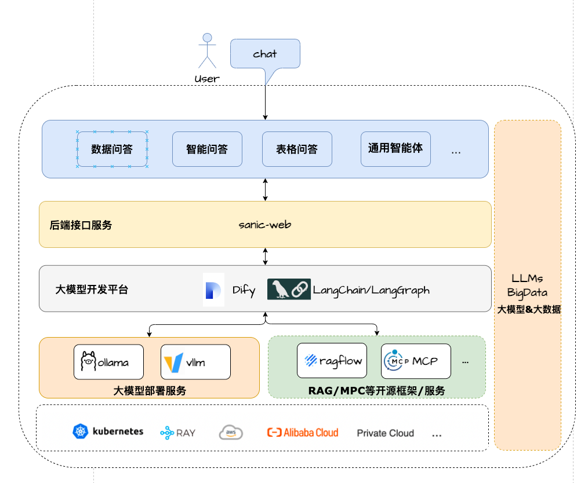
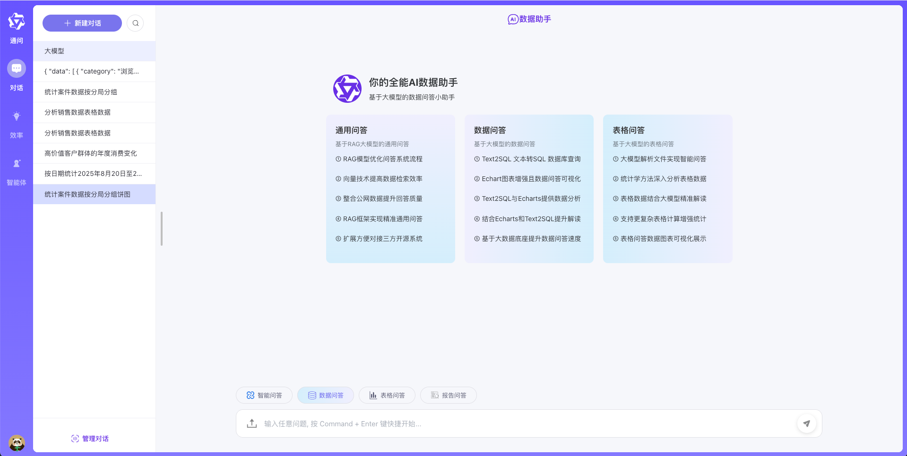
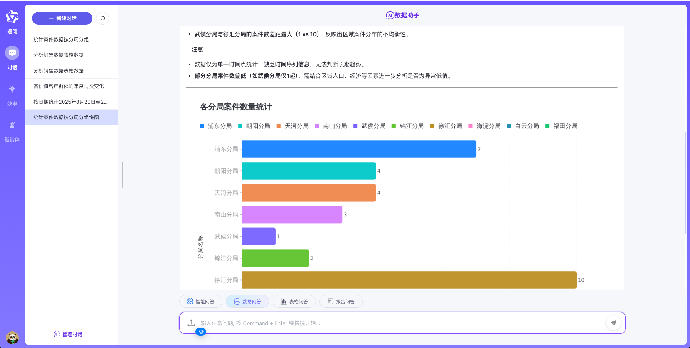
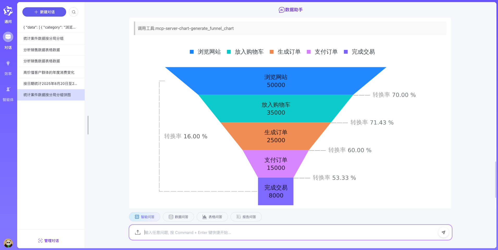
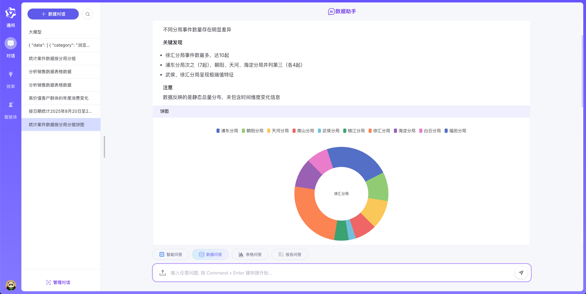

# 大模型数据助手

🌟 **项目简介**

一个轻量级、支持全链路且易于二次开发的大模型应用项目 

**已集成MCP多智能体架构**

基于 **Dify 、LangChain1.0.x/LangGraph1.0.x、llamaIndex、Neo4j、MCP、Ollama&Vllm、Sanic 和 Text2SQL** 📊 等技术构建的一站式大模型应用开发项目，采用 
**Vue3、TypeScript** 和 
**Vite 5** 
打造现代UI。它支持通过 **ECharts** 📈 / **AntV((mcp-server-chart)**
实现基于大模型的数据图形化问答，具备处理 **CSV** 文件 📂 表格问答的能力。同时，能方便对接第三方开源 **RAG** 系统 检索系统 🌐等，以支持广泛的通用知识问答。

作为轻量级的大模型应用开发项目，**Sanic-Web** 🛠️ 支持快速迭代与扩展，助力大模型项目快速落地。🚀

## 架构方案

## 🎉 **特性**
- **多智能体**: 支持多模型、多智能体+MCP协同任务
- **大模型交互**: 全面支持主流大模型交互框架，如 Dify 与 LangChain
- **核心技术栈**：Dify + Ollama + RAG + (Qwen3/DeepSeek) + Text2SQL + MCP + Neo4J + LangGraph
- **UI 框架**： Vue 3 + TypeScript + Vite 5
- **数据问答**：集成 ECharts/AntV大模型实现Text2SQL轻量级的图形化数据问答展示
- **表格问答**：支持 CSV格式文件的上传与基于大模型总结预处理和Text2SQL的表格数据问答
- **通用问答**：支持通用数据形式问答基于对接三方RAG系统+公网检索模式
- **应用架构**：作为一个轻量级全链路一站式大模型应用开发框架方便扩展落地
- **灵活部署**：支持大模型应用开发各依赖组件docker-compose一键拉起快速部署零配置

## 案例展示

<table>
<tbody>
<tr>
<td></td>
<td></td>
</tr>
<tr>
<td></td>
<td></td>
</tr>
</tbody>
</table>

<table>
<tbody>
<tr>
<td>

<video src="https://github.com/user-attachments/assets/0186b574-8267-4e99-8b9d-77eaee4fd02e" controls="controls" muted="muted" class="d-block rounded-bottom-2 border-top width-fit" style="max-height:640px; min-height: 200px">
</video>

<td>

<video src="https://github.com/user-attachments/assets/5037ba3b-4480-4be0-8d19-74a18cfd1225" controls="controls" muted="muted" class="d-block rounded-bottom-2 border-top width-fit" style="max-height:640px; min-height: 200px">
</video>

</td>
</tr>
<tr>
<td>
<video src="https://github.com/user-attachments/assets/8dad64a6-8eee-4d68-a0f4-f30e92f52594" controls="controls" muted="muted" class="d-block rounded-bottom-2 border-top width-fit" style="max-height:640px; min-height: 200px">
</video>
</td>
<td>

<video src="https://github.com/user-attachments/assets/228d5710-12d8-4ae4-bad1-65135813745f" controls="controls" muted="muted" class="d-block rounded-bottom-2 border-top width-fit" style="max-height:640px; min-height: 200px">
</video>

</td>
</tr>
</tbody>
</table>

## 🌹 支持

如果你喜欢这个项目或发现有用，可以点右上角 [`Star`](https://github.com/apconw/sanic-web) 支持一下，你的支持是我们不断改进的动力，感谢！ ^_^

## 💼 商务合作
- 我们能承接 写作类、报告类、数据问答、表格问答、**数字人大屏**等具体垂直业务场景的项目需求和方案，欢迎联系微信(备注 **商务合作**)

## 🐳 关于一对一技术支持申明
- 开源不易，本人精力和时间有限，如需**一对一技术支持**，请先赞助。联系微信**weber812**(备注 **技术支持**)
- 支持解决Dify画布前端展示不美观、缺乏登录权限等问题，提供需求开发支持。
- 帮你快速落地具体场景的画布适配开发，通过 Demo 展示，助力你高效完成 ***kip*** 考核。

| 技术支持方式                                          |     赞助     | 
|:------------------------------------------------|:----------:|
| 一对一技术支持 我将亲自远程帮您 **配置环境并部署** **讲解项目架构&大模型学习资料** | **100元/次** |
| 技术顾问 **解答大模型开发相关问题&技术支持**                       |  **365元**  |
| 需求开发支持 **具体场景Dify画布开发** **下面开源Dify画布前后端适配开发**   | **500元起**  |   

## 💬👥 技术支持群
- 想了解更多？欢迎关注并转发下面我的微信公众号文章(持续更新中)。
- 感谢支持，**您的赞助**将帮助我们持续更新！***入群方式请查看下面公众号文章末尾说明***。

<table>
<tbody>
<tr>
<td></td>
<td><a href="https://mp.weixin.qq.com/s/kxzDs0chEqHYBYE_u8TZZw">大模型如何读懂任何格式文件并自动生成报告？LangGraph + MCP 实战解析</a></td>
</tr>
<tr>
<td></td>
<td><a href="https://mp.weixin.qq.com/s/8KmZaIEnCZlHFp_1oyknMA">用 AntV MCP Server Chart 赋能大模型 —— 从零构建可视化智能体，图表生成效率飙升！</a></td>
</tr>
<tr>
<td></td>
<td><a href="https://mp.weixin.qq.com/s/XOdAeua2UyPxASM1CeXPmg">Neo4j构建语义图谱，大模型秒懂表关系，Text2SQ准确率狂飙300%！告别瞎猜！</a></td>
</tr>
<tr>
<td></td>
<td><a href="https://mp.weixin.qq.com/s/sjCJNbdoNAfFOECWUKfElw">用 BM25 + 中文分词实现 Text2SQL 表过滤 —— 让大模型只看“相关表”，准确率飙升！</a></td>
</tr>
</tbody>
</table>

### 常用DSL清单搜集
- **以下DSL清单来源声明：https://github.com/wwwzhouhui/dify-for-dsl.git 项目作者：wwwzhouhui**

| DSL清单名称                                                                                                                                                       | 工作流显示                         | 用到技术                                                     | 更新时间                                                 | 作者                                       | 适用dify版本                               |
|---------------------------------------------------------------------------------------------------------------------------------------------------------------| ------------------------------------------------------------ | ------------------------------------------------------------ | ------------------------------------------------------------ | ------------------------------------------------------------ | ---------------------------------------- |
| [零代码搞定 DIFY 插件开发：小白也能上手的文生图插件实战.yml](https://aqma351r01f.feishu.cn/wiki/C0xNwYMbWi6kkokmwsVc7q3ynJc?table=tbleOWb4WgXcxiHK&view=vewGwwbpzl)                   |  | qwen-image插件（自己开发的） | 2025年8月20日 | wwwzhouhui | 1.6.0 |
| [100% 识别率！发票、汇票、信用证全搞定的通用票据识别工作流.yml](https://aqma351r01f.feishu.cn/wiki/C0xNwYMbWi6kkokmwsVc7q3ynJc?table=tbleOWb4WgXcxiHK&view=vewGwwbpzl)                  |  | 条件判断、http请求、LLM大语言模型、代码处理 | 2025年8月13日 | wwwzhouhui | 1.6.0 |
| [用 Qwen Code+Dify 一键生成交互式元素周期表网页.yml](https://aqma351r01f.feishu.cn/wiki/C0xNwYMbWi6kkokmwsVc7q3ynJc?table=tbleOWb4WgXcxiHK&view=vewGwwbpzl)                  |  | LLM大语言模型、代码处理 | 2025年8月10日 | wwwzhouhui | 1.6.0 |
| [Dify 秘塔搜索工作流搭建教程与效果展示.yml](https://aqma351r01f.feishu.cn/wiki/C0xNwYMbWi6kkokmwsVc7q3ynJc?table=tbleOWb4WgXcxiHK&view=vewGwwbpzl)                            |  | 条件分支、http请求、代码处理、秘搭API | 2025年8月9日 | 阿文 | 1.6.0 |
| [Dify 工作流一键生成发票申请预览，对接开票系统超简单.yml](https://aqma351r01f.feishu.cn/wiki/C0xNwYMbWi6kkokmwsVc7q3ynJc?table=tbleOWb4WgXcxiHK&view=vewGwwbpzl)                     |  | excel工具、LLM大语言模型、代码处理 | 2025年8月6日 | wwwzhouhui | 1.6.0 |
| [用 Dify 实现多语言 PDF 文档原格式翻译.yml](https://aqma351r01f.feishu.cn/wiki/C0xNwYMbWi6kkokmwsVc7q3ynJc?table=tbleOWb4WgXcxiHK&view=vewGwwbpzl)                         |  | Agent、MCP-Server | 2025年7月30日 | wwwzhouhui | 1.6.0 |
| [用Kimi-K2+Mermaid 神器，一键生成系统架构图！小白也能秒会.yml](https://aqma351r01f.feishu.cn/wiki/C0xNwYMbWi6kkokmwsVc7q3ynJc?table=tbleOWb4WgXcxiHK&view=vewGwwbpzl)             |  | 开始、文档管理器、LLM大语言、Mermaid插件 | 2025年7月19日 | wwwzhouhui | 1.6.0 |
| [用 Dify 一键搭建七牛云oss工作流](https://aqma351r01f.feishu.cn/wiki/C0xNwYMbWi6kkokmwsVc7q3ynJc?table=tbleOWb4WgXcxiHK&view=vewGwwbpzl)                                 |  | 开始、Agent、LLM大语言模型、代码执行、直接回复 | 2025年7月11日 | GeekAPP | 1.4.3 |
| [用 Dify 一键搭建数学公式识别工作流，支持laTex](https://aqma351r01f.feishu.cn/wiki/C0xNwYMbWi6kkokmwsVc7q3ynJc?table=tbleOWb4WgXcxiHK&view=vewGwwbpzl)                         |  | 开始、Agent、LLM大语言模型、代码执行、直接回复 | 2025年7月11日 | GeekAPP | 1.4.3 |
| [用 Dify 一键搭建中药科普工作流，文字 + 图片 + 视频全搞定](https://aqma351r01f.feishu.cn/wiki/C0xNwYMbWi6kkokmwsVc7q3ynJc?table=tbleOWb4WgXcxiHK&view=vewGwwbpzl)                   |  | 开始节点、AGENT、直接回复、自定义MCP-Server | 2025年7月3日 | wwwzhouhui | 1.4.3 |
| [用 Dify 一键生成 长安的荔枝金句 HTML 页面，三步搞定！.yml](https://aqma351r01f.feishu.cn/wiki/C0xNwYMbWi6kkokmwsVc7q3ynJc?table=tbleOWb4WgXcxiHK&view=vewGwwbpzl)                |  | 开始、Agent、LLM大语言模型、代码执行、直接回复 | 2025年6月27日 | wwwzhouhui | 1.4.3 |
| [Dify 轻松实现 PPT 到 SVG 海报的华丽变身_合合版.yml](https://aqma351r01f.feishu.cn/wiki/C0xNwYMbWi6kkokmwsVc7q3ynJc?table=tbleOWb4WgXcxiHK&view=vewGwwbpzl)                  |  | 开始、合合通用文档解析、LLM大语言模型、直接回复 | 2025年6月22日 | wwwzhouhui | 1.4.3 |
| [Dify 轻松实现 PPT 到 SVG 海报的华丽变身-MinerU版.yml](https://aqma351r01f.feishu.cn/wiki/C0xNwYMbWi6kkokmwsVc7q3ynJc?table=tbleOWb4WgXcxiHK&view=vewGwwbpzl)              |  | 开始、MinerU、LLM大语言模型、直接回复 | 2025年6月22日 | wwwzhouhui | 1.4.3 |
| [中药科普知识工作流.yml](https://aqma351r01f.feishu.cn/wiki/C0xNwYMbWi6kkokmwsVc7q3ynJc?table=tbleOWb4WgXcxiHK&view=vewGwwbpzl)                                        |  | 开始节点、AGENT、直接回复、自定义MCP-Server | 2025年6月18日 | 醒醒、wwwzhouhui | 1.4.0 |
| [豆包文本生成图、文生视频+小支付功能](https://aqma351r01f.feishu.cn/wiki/C0xNwYMbWi6kkokmwsVc7q3ynJc?table=tbleOWb4WgXcxiHK&view=vewGwwbpzl)                                   |  | 开始节点、条件分支、AGENT、小支付、直接回复 | 2025年6月14日 | wwwzhouhui | 1.4.0 |
| [N8N+Dify 打造新闻定时推送流.yml](https://aqma351r01f.feishu.cn/wiki/C0xNwYMbWi6kkokmwsVc7q3ynJc?table=tbleOWb4WgXcxiHK&view=vewGwwbpzl)                               |  | 条件分支、rookie_rss(第三方工具)、变量聚合器、代码执行、llm文本模型、获取时间（第三方工具）、163SMTP邮件发送 | 2025年6月10日 | wwwzhouhui | 1.4.0 |
| [Dify+RSS 聚合 8 大平台实时热点，新闻获取效率飙升 300%.yml](https://aqma351r01f.feishu.cn/wiki/C0xNwYMbWi6kkokmwsVc7q3ynJc?table=tbleOWb4WgXcxiHK&view=vewGwwbpzl)              |  | 条件分支、rookie_rss(第三方工具)、变量聚合器、代码执行、llm文本模型、获取时间（第三方工具） | 2025年6月9日 | wwwzhouhui | 1.4.0 |
| [批量识别PDF电子发票信息生成excle表格.yml](https://aqma351r01f.feishu.cn/wiki/C0xNwYMbWi6kkokmwsVc7q3ynJc?table=tbleOWb4WgXcxiHK&view=vewGwwbpzl)                           |  | 迭代、pdf转png转换器（第三方工具）、多模态大语言模型、代码执行、飞书表格 | 2025年6月6日 | wwwzhouhui | 1.4.0 |
| [豆包文本生成图像、文本生成视频以及图像转视频.yml](https://aqma351r01f.feishu.cn/wiki/C0xNwYMbWi6kkokmwsVc7q3ynJc?table=tbleOWb4WgXcxiHK&view=vewGwwbpzl)                           |  | 条件分支、llm大语言模型、Doubao Image and Video Generator 的插件 | 2025年6月3日 | wwwzhouhui | 1.4.0 |
| [衡水体英语作文评分工作流.yml](https://aqma351r01f.feishu.cn/wiki/C0xNwYMbWi6kkokmwsVc7q3ynJc?table=tbleOWb4WgXcxiHK&view=vewGwwbpzl)                                     |  | 模板转换、条件分支、pdf转png转换器（第三方工具）、基于多模态llm大语言模型、变量聚合器、基于文本大语言模型 | 2025年6月2日 | wwwzhouhui | 1.4.0 |
| [中小学数学错题本-生成同类型题.yml](https://aqma351r01f.feishu.cn/wiki/C0xNwYMbWi6kkokmwsVc7q3ynJc?table=tbleOWb4WgXcxiHK&view=vewGwwbpzl)                                  |  | 问题分类器、模板转换、条件分支、代码处理、SQL Execute、变量赋值、迭代、获取当前时间、Markdown转PDF文件、LLM大语言模型等 | 2025年5月30日 | wwwzhouhui | 1.4.0 |
| [中小学数学错题本-错题收集篇.yml](https://aqma351r01f.feishu.cn/wiki/C0xNwYMbWi6kkokmwsVc7q3ynJc?table=tbleOWb4WgXcxiHK&view=vewGwwbpzl)                                   |  | 开始节点、模板转换、条件分支、pdf转png转换器（第三方工具）、基于多模态llm大语言模型、变量聚合器、代码执行、迭代、SQL Execute（第三方工具） | 2025年5月28日 | wwwzhouhui | 1.4.0 |
| [0 代码实现企业画像！16 种图表，解锁数据查询新姿势.yml](https://aqma351r01f.feishu.cn/wiki/C0xNwYMbWi6kkokmwsVc7q3ynJc?table=tbleOWb4WgXcxiHK&view=vewGwwbpzl)                      |  | 问题分类器、mcp-sse、mcp-server-chart、MCP Agent 策略工具、企业信息查询的MCP-Server | 2025年5月27日 | wwwzhouhui | 1.4.0 |
| [英语单词口语练习.yml](https://aqma351r01f.feishu.cn/wiki/C0xNwYMbWi6kkokmwsVc7q3ynJc?table=tbleOWb4WgXcxiHK&view=vewGwwbpzl)                                         |  | llm大语言模型、参数提取器、Markdown转HTML文件 | 2025年5月24日 | wwwzhouhui | 1.4.0 |
| [海报封面生成工作流-Wanx 文生图.yml](https://aqma351r01f.feishu.cn/wiki/C0xNwYMbWi6kkokmwsVc7q3ynJc?table=tbleOWb4WgXcxiHK&view=vewGwwbpzl)                               |  | 阿里云百炼MCP Agent（Wanx 文生图）、条件分支、变量聚合器、模版转换、代码执行 | 2025年5月23日 | wwwzhouhui | 1.4.0 |
| [12306mcp火车票信息查询-chatflow.yml](https://aqma351r01f.feishu.cn/wiki/C0xNwYMbWi6kkokmwsVc7q3ynJc?table=tbleOWb4WgXcxiHK&view=vewGwwbpzl)                         |  | AGNET策略工具、12306MCP、mcphub | 2025年5月21日 | wwwzhouhui | 1.4.0 |
| [3步实现音视频转文字会议纪要从此无忧.yml](https://aqma351r01f.feishu.cn/wiki/C0xNwYMbWi6kkokmwsVc7q3ynJc?table=tbleOWb4WgXcxiHK&view=vewGwwbpzl)                               |  | ffmpeg、Speech To Text、ASR模型、LLM大语言模型 | 2025年5月20日 | wwwzhouhui | 1.4.0 |
| [基于上市公司财报分析结果html分析报告（整合MinerU+edgeone-pages-mcp）.yml](https://aqma351r01f.feishu.cn/wiki/C0xNwYMbWi6kkokmwsVc7q3ynJc?table=tbleOWb4WgXcxiHK&view=vewGwwbpzl) |  | mineru插件、LLM大语言模型、参数提取器、代码处理生成 | 2025年5月13日 | wwwzhouhui | 1.13 |
| [多模态图像编辑(HiDream-E1-Full)chatflow.yml](https://aqma351r01f.feishu.cn/wiki/C0xNwYMbWi6kkokmwsVc7q3ynJc?table=tbleOWb4WgXcxiHK&view=vewGwwbpzl)                 |  | 图片转base64、条件分支、代码转换、变量赋值、2个自定义工具 | 2025年5月10日 | wwwzhouhui | 1.13 |
| [图片生成html,网页小游戏（1panel mcpsse）.yml](https://aqma351r01f.feishu.cn/wiki/C0xNwYMbWi6kkokmwsVc7q3ynJc?table=tbleOWb4WgXcxiHK&view=vewGwwbpzl)                    |  | 1panelmcp、问题分类器、AGNET策略工具、edgeone-pages-mcp-server | 2025年5月3日 | wwwzhouhui | 1.13 |
| [通用合同审查助手.yml](https://aqma351r01f.feishu.cn/wiki/C0xNwYMbWi6kkokmwsVc7q3ynJc?table=tbleOWb4WgXcxiHK&view=vewGwwbpzl)                                         |  | qwen3最新模型、文档提取器、markdown转换器 | 2025年4月29日 | 堕落奶酪、wwwzhouhui | 1.3.1 |
| [魔搭社区MCP-Server.yml](https://aqma351r01f.feishu.cn/wiki/C0xNwYMbWi6kkokmwsVc7q3ynJc?table=tbleOWb4WgXcxiHK&view=vewGwwbpzl)                                   |  | 问题分类器、AGNET策略工具、魔搭社区MCP-server(高德MCP 、好吃的、Tavily、LeetCode(力扣)) | 2025年4月26日 | wwwzhouhui | 1.1.3 |
| [基于表结构的agent text2sql.yml](https://aqma351r01f.feishu.cn/wiki/C0xNwYMbWi6kkokmwsVc7q3ynJc?table=tbleOWb4WgXcxiHK&view=vewGwwbpzl)                             |  | AGNET | 2025年4月24日 | wwwzhouhui | 1.1.3 |
| [基于知识库+agent实现text2sqlchatflow工作流.yml](https://aqma351r01f.feishu.cn/wiki/C0xNwYMbWi6kkokmwsVc7q3ynJc?table=tbleOWb4WgXcxiHK&view=vewGwwbpzl)                 |  | 知识检索、AGNET策略工具、database插件 | 2025年4月24日 | wwwzhouhui | 1.1.3 |
| [软件开发类合同审查chatflow.yml](https://aqma351r01f.feishu.cn/wiki/C0xNwYMbWi6kkokmwsVc7q3ynJc?table=tbleOWb4WgXcxiHK&view=vewGwwbpzl)                                |  | llm、文档提取器、markdown转换器、企业微信 | 2025年4月23日 | wwwzhouhui | 1.1.3 |
| [提示词生成器chatflow.yml](https://aqma351r01f.feishu.cn/wiki/C0xNwYMbWi6kkokmwsVc7q3ynJc?table=tbleOWb4WgXcxiHK&view=vewGwwbpzl)ksa                                |  | llm、条件判断器 | 2025年4月19日 | wwwzhouhui | 1.1.3 |
| [儿童故事绘本-PPT chatflow.yml](https://aqma351r01f.feishu.cn/wiki/C0xNwYMbWi6kkokmwsVc7q3ynJc?table=tbleOWb4WgXcxiHK&view=vewGwwbpzl)                              |  | agent、markdown转换器 | 2025年4月14日 | wwwzhouhui | 1.1.3 |
| [儿童故事绘本-PPT Agent.yml](https://aqma351r01f.feishu.cn/wiki/C0xNwYMbWi6kkokmwsVc7q3ynJc?table=tbleOWb4WgXcxiHK&view=vewGwwbpzl)                                 |  | llm、markdown转PPTX 转换器 | 2025年4月14日 | wwwzhouhui | 1.1.3 |
| [学生成绩查询Chatflow支持text2sql.yml](https://aqma351r01f.feishu.cn/wiki/C0xNwYMbWi6kkokmwsVc7q3ynJc?table=tbleOWb4WgXcxiHK&view=vewGwwbpzl)                         |  | 时间工具、ECharts图表生成、database、llm | 2025年4月9日 | wwwzhouhui | 1.1.3 |
| [dify-mcp-sse+Zapier MCP新闻检索邮件发送.yml](https://aqma351r01f.feishu.cn/wiki/C0xNwYMbWi6kkokmwsVc7q3ynJc?table=tbleOWb4WgXcxiHK&view=vewGwwbpzl)                  |  | mcp-sse、Zapier MCP | 2025年4月7日 | wwwzhouhui | 1.1.3 |
| [物头像风格迁移工作流.yml](https://aqma351r01f.feishu.cn/wiki/C0xNwYMbWi6kkokmwsVc7q3ynJc?table=tbleOWb4WgXcxiHK&view=vewGwwbpzl)                                       |  | http接口请求、逆向人物头像风格迁移fastapi接口实现 | 2025年4月4日 | wwwzhouhui | 1.1.3 |
| [免费即梦文生视频.yml](https://aqma351r01f.feishu.cn/wiki/C0xNwYMbWi6kkokmwsVc7q3ynJc?table=tbleOWb4WgXcxiHK&view=vewGwwbpzl)                                         |  | 文本模型、http接口请求、 逆向即梦文生视频fastapi接口实现 | 2025年4月1日 | wwwzhouhui | 0.15.3 |
| [周易大师.yml](https://aqma351r01f.feishu.cn/wiki/C0xNwYMbWi6kkokmwsVc7q3ynJc?table=tbleOWb4WgXcxiHK&view=vewGwwbpzl)                                             |  | 周易大师 | 2025年3月26日 | gordon | 0.0.1 |
| [大学生计算机专业简历美化工作流.yml](https://aqma351r01f.feishu.cn/wiki/C0xNwYMbWi6kkokmwsVc7q3ynJc?table=tbleOWb4WgXcxiHK&view=vewGwwbpzl)                                  |  | 模版转换、文本模型、多模态模型、文档提取器 | 2025年3月26日 | wwwzhouhui | 0.15.3 |
| [文生Word_Http_Post.yml 、文生Word_Agent.yml](https://aqma351r01f.feishu.cn/wiki/C0xNwYMbWi6kkokmwsVc7q3ynJc?table=tbleOWb4WgXcxiHK&view=vewGwwbpzl)               |  | ai agent、自定义workflow、http请求 | 2025年3月25日 | wwwzhouhui+jenal | 0.15.3 or 1.1.2 |
| [中英文翻译工作流-AI辅助生成.yml](https://aqma351r01f.feishu.cn/wiki/C0xNwYMbWi6kkokmwsVc7q3ynJc?table=tbleOWb4WgXcxiHK&view=vewGwwbpzl)                                                                                                                                         |  | llm大语言模型 | 2025年3月23日 | wwwzhouhui+trae | 0.15.3 |
| [gemini-2.0-flash-exp-image-generation-文生图智能体.yml](https://aqma351r01f.feishu.cn/wiki/C0xNwYMbWi6kkokmwsVc7q3ynJc?table=tbleOWb4WgXcxiHK&view=vewGwwbpzl)                                                                                                              |  | 问题分类器、条件分支、自定义工具、变量赋值 | 2025年3月20日 | wwwzhouhui | 0.15.3 |
| [儿童故事绘本文生视频语音合成版 .yml](https://aqma351r01f.feishu.cn/wiki/C0xNwYMbWi6kkokmwsVc7q3ynJc?table=tbleOWb4WgXcxiHK&view=vewGwwbpzl)                                                                                                                                          |  | http接口请求、文本生成模型、文生图模型、edgetts、ffmpeg | 2025年3月18 | wwwzhouhui | 0.15.3 |
| [大模型表格解析自动生成代码生成统计图.yml](https://aqma351r01f.feishu.cn/wiki/C0xNwYMbWi6kkokmwsVc7q3ynJc?table=tbleOWb4WgXcxiHK&view=vewGwwbpzl)                                                                                                                                        |  | http接口请求、文档提取功能、文本生成模型 | 2025年3月13 | wwwzhouhui | 0.15.3 |
| [股票分析系统-Gordon修改版.yml](https://aqma351r01f.feishu.cn/wiki/C0xNwYMbWi6kkokmwsVc7q3ynJc?table=tbleOWb4WgXcxiHK&view=vewGwwbpzl)                                                                                                                                          |  | 增加用户输入文本参数提取 http接口请求、文本生成模型、Akshare股票数据接口、条件分支、变量聚合器 | 2025年3月18 | Gordon | 0.15.3 |
| [股票分析系统.yml](https://aqma351r01f.feishu.cn/wiki/C0xNwYMbWi6kkokmwsVc7q3ynJc?table=tbleOWb4WgXcxiHK&view=vewGwwbpzl)                                                                                                                                                    |  | http接口请求、文本生成模型、Akshare股票数据接口、条件分支、变量聚合器 | 2025年3月11 日 | wwwzhouhui | 0.15.3 |
| [API文档生成代码.yml](https://aqma351r01f.feishu.cn/wiki/C0xNwYMbWi6kkokmwsVc7q3ynJc?table=tbleOWb4WgXcxiHK&view=vewGwwbpzl)                                                                                                                                                 |  | jina-ai、文档提取功能、文本生成模型 | 2025年3月9 日 | wwwzhouhui | 0.15.3 |
| [AI绘画+飞书+企业微信整合.yml](https://aqma351r01f.feishu.cn/wiki/C0xNwYMbWi6kkokmwsVc7q3ynJc?table=tbleOWb4WgXcxiHK&view=vewGwwbpzl)                                                                                                                                            |  | http接口请求、jimeng-free-api、飞书表格、企业微信 | 2025年3月7 日 | wwwzhouhui | 0.15.3 |
| [知识库检索工作流.yml](https://aqma351r01f.feishu.cn/wiki/C0xNwYMbWi6kkokmwsVc7q3ynJc?table=tbleOWb4WgXcxiHK&view=vewGwwbpzl)                                                                                                                                                  |  | 文本生成模型、知识库RAG、知识检索 | 2025年3月3 日 | wwwzhouhui | 0.15.3 |
| [生成绩查询工作流（带数据库查询）.yml](https://aqma351r01f.feishu.cn/wiki/C0xNwYMbWi6kkokmwsVc7q3ynJc?table=tbleOWb4WgXcxiHK&view=vewGwwbpzl)                                                                                                                                          |  | 文本生成模型、柱状图、数据库查询、http接口请求、table markdown | 2025年2月27 日 | wwwzhouhui | 0.15.3 |
| [excel表格提取+echarts展示.yml](https://aqma351r01f.feishu.cn/wiki/C0xNwYMbWi6kkokmwsVc7q3ynJc?table=tbleOWb4WgXcxiHK&view=vewGwwbpzl)                                                                                                                                       |  | 文本生成模型、文档提取功能、echarts | 2025年2月25 日 | wwwzhouhui | 0.15.3 |
| [ai agent智能体.yml](https://aqma351r01f.feishu.cn/wiki/C0xNwYMbWi6kkokmwsVc7q3ynJc?table=tbleOWb4WgXcxiHK&view=vewGwwbpzl)                                                                                                                                               |  | 文本生成模型、联网搜索、获取当前系统时间、AI绘画、语音播报等智能体功能组合。 | 2025年2月22 日 | wwwzhouhui | 0.15.3 |
| [文生视频+tts语音播报.yml](https://aqma351r01f.feishu.cn/wiki/C0xNwYMbWi6kkokmwsVc7q3ynJc?table=tbleOWb4WgXcxiHK&view=vewGwwbpzl)                                                                                                                                              |  | 文本生成模型、http接口请求、edgetts、文本生成视频模型（接口调用） | 2025年2月20 日 | wwwzhouhui | 0.15.3 |
| [儿童故事绘本.yml](https://aqma351r01f.feishu.cn/wiki/C0xNwYMbWi6kkokmwsVc7q3ynJc?table=tbleOWb4WgXcxiHK&view=vewGwwbpzl)                                                                                                                                                    |  | 文本生成模型、http接口请求、jimeng-free-api、edgetts | 2025年2月15日 | wwwzhouhui | 0.15.3 |
| [飞书表格.yml](https://aqma351r01f.feishu.cn/wiki/C0xNwYMbWi6kkokmwsVc7q3ynJc?table=tbleOWb4WgXcxiHK&view=vewGwwbpzl)                                                                                                                                                      |  | 文本生成模型、dify内置工具、飞书表格 | 2025年2月12日 | wwwzhouhui | 0.15.3 |
| [自带edgetts.yml](https://aqma351r01f.feishu.cn/wiki/C0xNwYMbWi6kkokmwsVc7q3ynJc?table=tbleOWb4WgXcxiHK&view=vewGwwbpzl)                                                                                                                                                 |  | http接口请求、edgetts | 2025年2月10日 | wwwzhouhui | 0.15.3 |
| [自定义edgetts工作流.yml](https://aqma351r01f.feishu.cn/wiki/C0xNwYMbWi6kkokmwsVc7q3ynJc?table=tbleOWb4WgXcxiHK&view=vewGwwbpzl)                                                                                                                                             |  | http接口请求、edgetts | 2025年2月10日 | wwwzhouhui | 0.15.3 |
| [即梦AI绘画.yml](https://aqma351r01f.feishu.cn/wiki/C0xNwYMbWi6kkokmwsVc7q3ynJc?table=tbleOWb4WgXcxiHK&view=vewGwwbpzl)                                                                                                                                                    |  | http接口请求、jimeng-free-api | 2025年2月4日 | wwwzhouhui | 0.15.3 |
| [AI资讯每日新闻+语音播报工作流.yml](https://aqma351r01f.feishu.cn/wiki/C0xNwYMbWi6kkokmwsVc7q3ynJc?table=tbleOWb4WgXcxiHK&view=vewGwwbpzl)                                                                                                                                          |  | 文本生成模型、crawl4ai | 2025年2月3日 | wwwzhouhui | 0.15.3 |
| [YouTube博主和自媒体运营专家工作流.yml](https://aqma351r01f.feishu.cn/wiki/C0xNwYMbWi6kkokmwsVc7q3ynJc?table=tbleOWb4WgXcxiHK&view=vewGwwbpzl)                                                                                                                                      |  | 文本生成模型 | 2025年1月25日 | wwwzhouhui | 0.15.3 |
| [ai绘画整合comfyui_bizair.yml](https://aqma351r01f.feishu.cn/wiki/C0xNwYMbWi6kkokmwsVc7q3ynJc?table=tbleOWb4WgXcxiHK&view=vewGwwbpzl)                                                                                                                                      |  | http接口请求、comfui_bizair | 2025年1月22日 | wwwzhouhui | 0.15.3 |
| [诗句封面+语音播报.yml](https://aqma351r01f.feishu.cn/wiki/C0xNwYMbWi6kkokmwsVc7q3ynJc?table=tbleOWb4WgXcxiHK&view=vewGwwbpzl)                                                                                                                                                 |  | 文本生成模型、多模态模型、文生语音模型、http接口请求 | 2025年1月18日 | wwwzhouhui | 0.15.3 |
| [FLUX绘画机器人+多模态识别+语音播放.yml](https://aqma351r01f.feishu.cn/wiki/C0xNwYMbWi6kkokmwsVc7q3ynJc?table=tbleOWb4WgXcxiHK&view=vewGwwbpzl)                                                                                                                                      |  | 文本生成模型、多模态模型、文生图模型、文生语音模型 | 2025年1月12日 | wwwzhouhui | 0.15.3 |
| [Fine-tune 语料构造器.yml](https://aqma351r01f.feishu.cn/wiki/C0xNwYMbWi6kkokmwsVc7q3ynJc?table=tbleOWb4WgXcxiHK&view=vewGwwbpzl)                                                                                                                                           |  | 调用文本模型 | 2025年1月7日 | wwwzhouhui | 0.15.3 |
| [giteeKolors工作流.yaml](https://aqma351r01f.feishu.cn/wiki/C0xNwYMbWi6kkokmwsVc7q3ynJc?table=tbleOWb4WgXcxiHK&view=vewGwwbpzl)                                                                                                                                           |  | 自定义第三方接口服务封装文生图、使用gitee Serverless API 接口+腾讯云OSS存储 | 2024年12月18日 | wwwzhouhui | 0.15.3 |
| [中国历史专家播客.yml](https://aqma351r01f.feishu.cn/wiki/C0xNwYMbWi6kkokmwsVc7q3ynJc?table=tbleOWb4WgXcxiHK&view=vewGwwbpzl)                                                                                                                                                  |  | 调用文本模型、TEXT TO SPEECH工具组件使用 | 2024年11月26日 | wwwzhouhui | 0.15.3 |
| [抓取获取36氪热榜文章内容 .yml](https://aqma351r01f.feishu.cn/wiki/C0xNwYMbWi6kkokmwsVc7q3ynJc?table=tbleOWb4WgXcxiHK&view=vewGwwbpzl)                                                                                                                                            |  | 调用文本模型、http接口请求、jina-ai爬取网页信息、迭代 | 2024年11月16日 | wwwzhouhui | 0.15.3 |
| [发票比对专家-新版客运火车票2.yml](https://aqma351r01f.feishu.cn/wiki/C0xNwYMbWi6kkokmwsVc7q3ynJc?table=tbleOWb4WgXcxiHK&view=vewGwwbpzl)                                                                                                                                           |  | 调用多模态模型、文本模型 | 2024年11月16日 | wwwzhouhui | 0.15.3 |
| [发票提取小工具整合版-变量聚合器.yml](https://aqma351r01f.feishu.cn/wiki/C0xNwYMbWi6kkokmwsVc7q3ynJc?table=tbleOWb4WgXcxiHK&view=vewGwwbpzl)                                                                                                                                          |  | 调用多模态模型、文本模型、文件提取器、IF流程判断 | 2024年11月16日 | wwwzhouhui | 0.15.3 |
| [增值税发票提取小工具chatflow.yml](https://aqma351r01f.feishu.cn/wiki/C0xNwYMbWi6kkokmwsVc7q3ynJc?table=tbleOWb4WgXcxiHK&view=vewGwwbpzl)                                                                                                                                        |  | 调用多模态模型、文本模型、文件提取器 | 2024年11月16日 | wwwzhouhui | 0.15.3 |
| [FLUX绘画机器人.yml](https://aqma351r01f.feishu.cn/wiki/C0xNwYMbWi6kkokmwsVc7q3ynJc?table=tbleOWb4WgXcxiHK&view=vewGwwbpzl)                                                                                                                                                 |  | 调用FLUX绘画模型、文本模型、http接口请求                     | 2024年11月16日          | wwwzhouhui           | 0.15.3               |

## ⭐ Star History
 

## License

[MIT](./LICENSE) License | Copyright © 2024-PRESENT [AiAdventurer](https://github.com/apconw)
