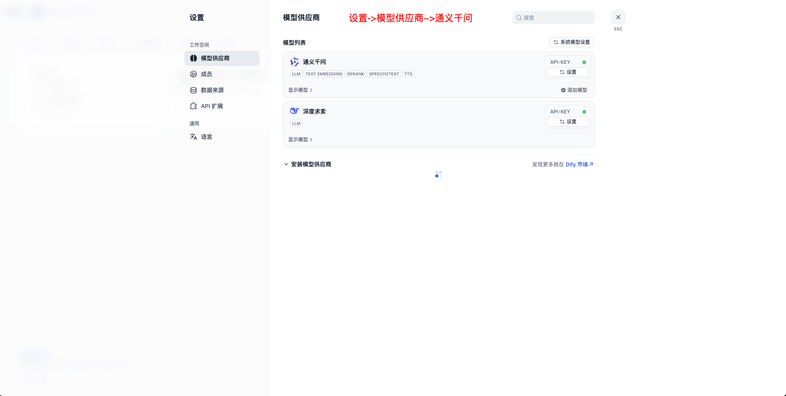

## 💡环境配置要求

在开始之前，请确保您的开发环境满足以下最低配置要求：

- **操作系统**：Windows 10/11, macOs M系列, Centos/Ubuntu
- **GPU**: 本地使用ollama部署，推荐使用Nvidia显卡或CPU模式。**推荐公网购买APIKEY形式**
- **内存**：8GB+

### 🔧 **前置条件**
* Python 3.11.x
* uv 0.8.0+
* Dify 0.7.1+
* Mysql 8.0+
* Node.js 18.12.x+
* Pnpm 9.x


### 📚 **大模型选择**
- 推荐购买公网大模型[阿里云公网大模型服务APIKEY](http://aliyun.com/product/bailian)
- 模型要求: **Qwen3/Qwen-Plus/Deepseek** 模型


### ⚙️ **Dify环境配置**

#### 1. Dify安装
- **安装Dify** [官方参考文档](https://docs.dify.ai/zh-hans)
- **如果已经安装过Dify环境，可跳过该步骤**
- 为了兼顾第一次接触大模型应用的同学，本项目提供了一键拉起Dify服务方便大家快速体验。
- Dify本机访问地址：http://localhost:18000 账号/密码: 需自己注册
```shell
# 拉起内置的dify服务
cd docker/dify/docker
docker-compose up -d
```
#### 2. Dify配置
 - 购买[阿里云公网大模型服务APIKEY](http://aliyun.com/product/bailian)
 - 导入项目根目录下的**docker/docker/dify/数据问答_v1.1.5_qwen_plus.yml画布** 
 - 获取画布对应的api-key先复制出来下面步骤会使用
 - 导入画布后需要手动选择一下配置的大模型并保存
 - 画布HTTP节点地址修改,本地部署默认不用修改服务器上需修改为实际IP地址
    - **服务器上启动host.docker.internal修改为实际IP地址**
 - 操作步骤如下图:
 
 
 


### ⚙️ MCP-HUB环境配置
- [官方文档](https://github.com/samanhappy/mcphub)
- MCP-HUB是一个开源的MCP聚合工具方便安装和管理MCP工具

#### 1. MCP-HUB安装
```bash
git clone https://github.com/apconw/sanic-web.git
cd docker

# 创建volume目录
mkdir -p ./volume/mcp-data

# 创建一个空的或默认的 mcp_settings.json 文件
touch ./volume/mcp-data/mcp_settings.json

# 启动容器
docker compose up -d mcphub
```
#### 2. MCP-HUB配置
- [登录MCP-HU](http://localhost:3300/) admin/admin123
- 安装CMP工具
```shell
npx -y 12306-mcp 铁路购票服务
npx -y @amap/amap-maps-mcp-server 高德地图服务
```


- **国内镜像配置**

