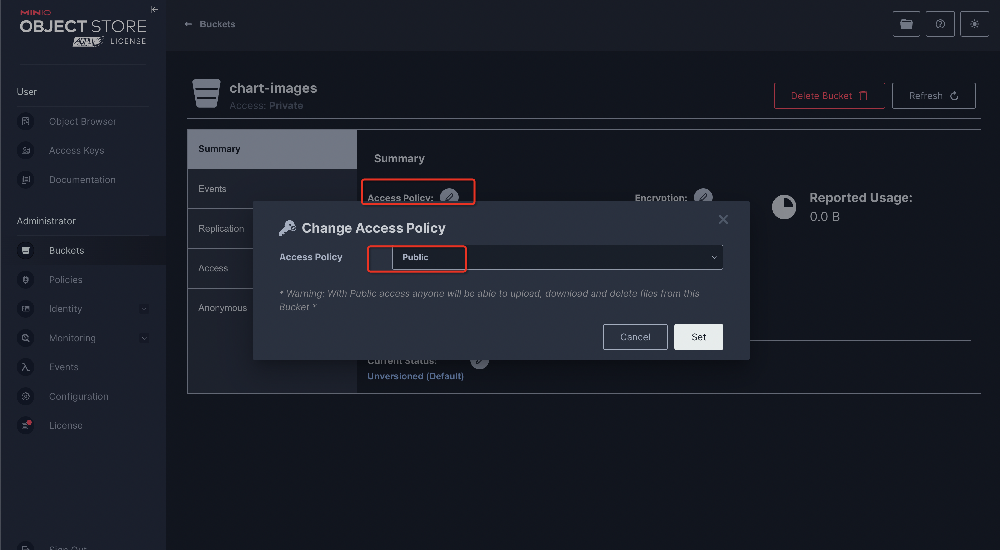
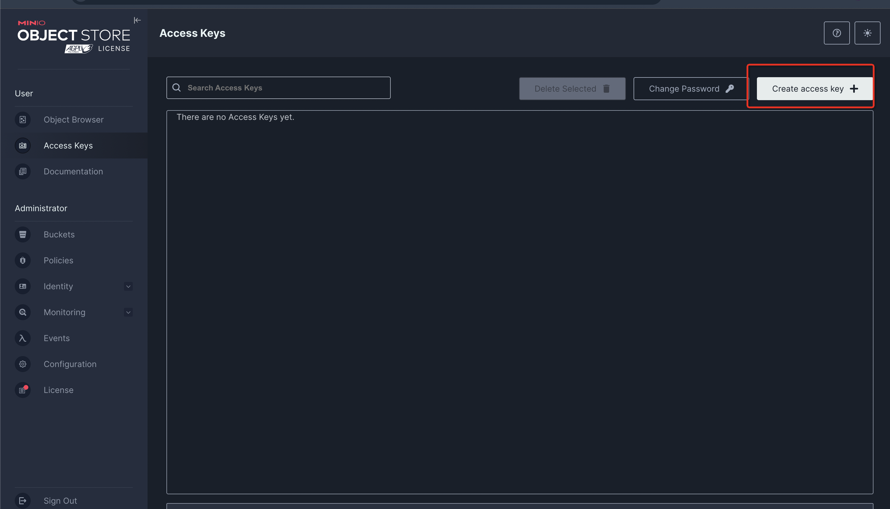
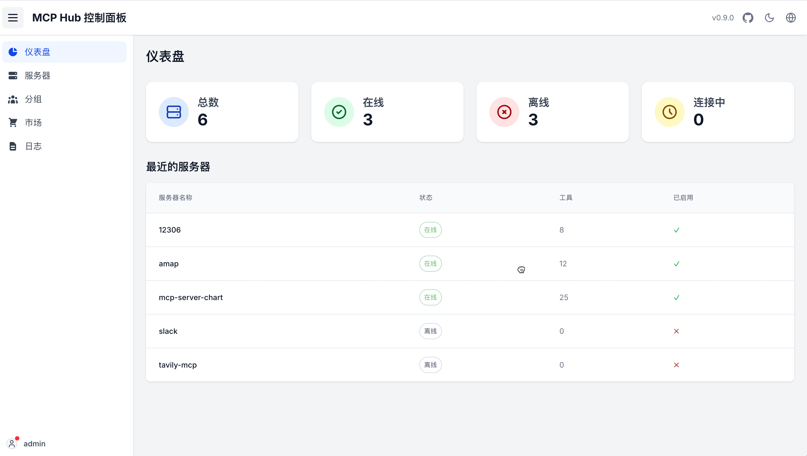
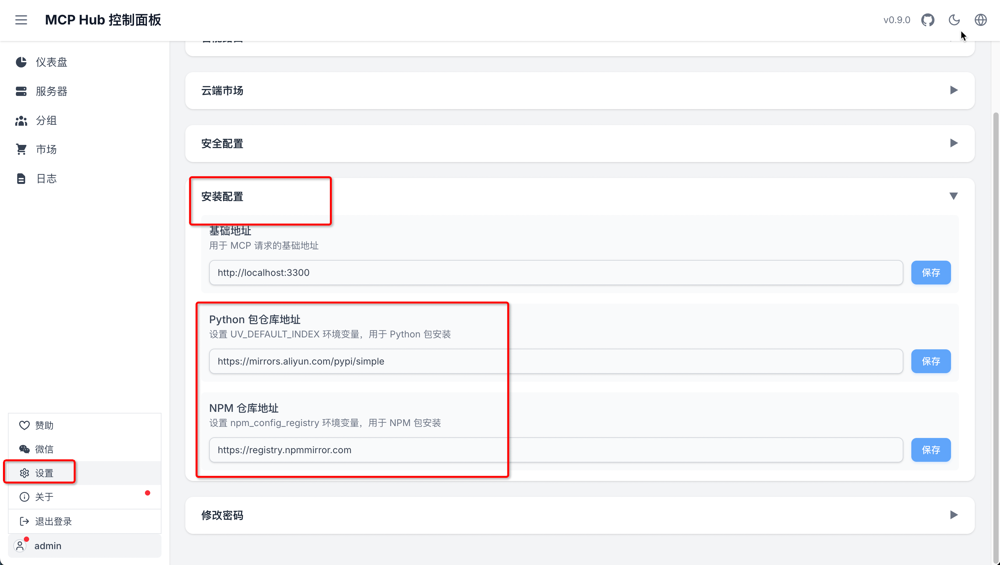
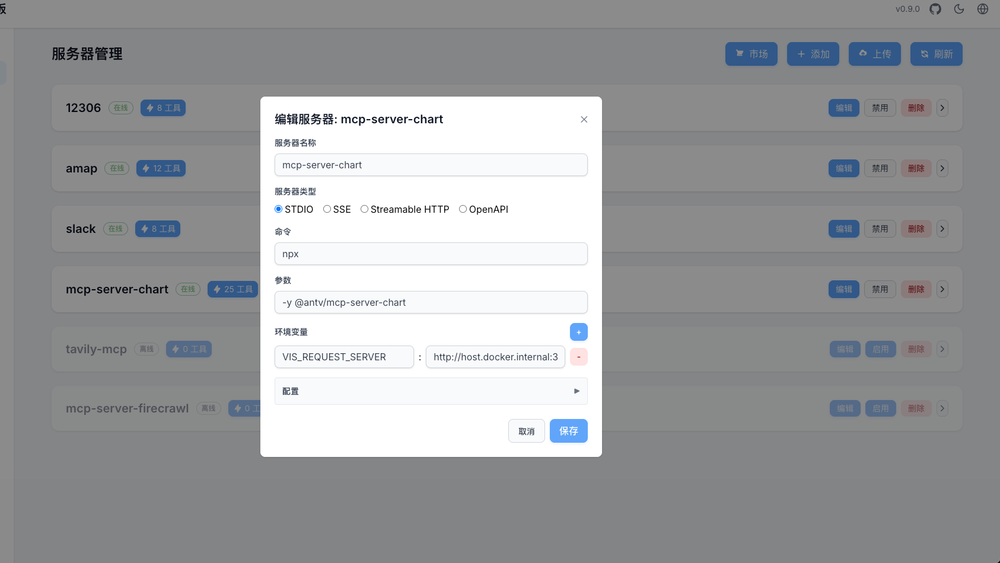
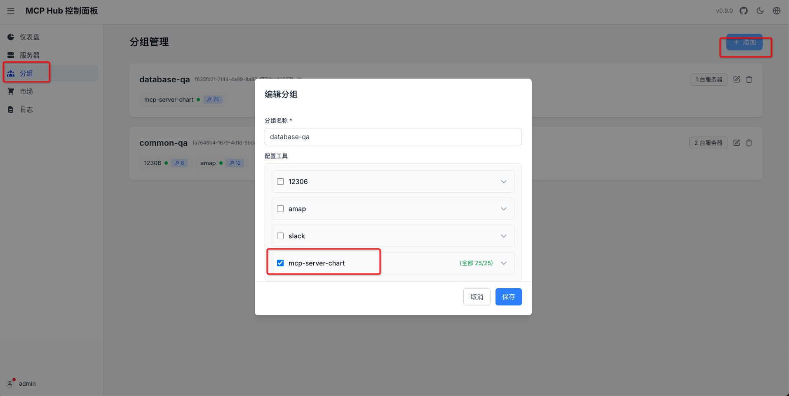
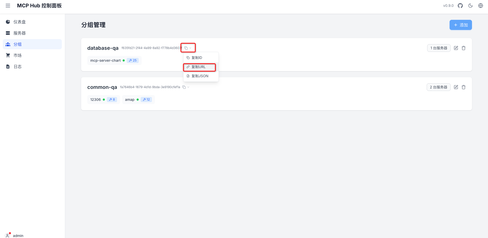
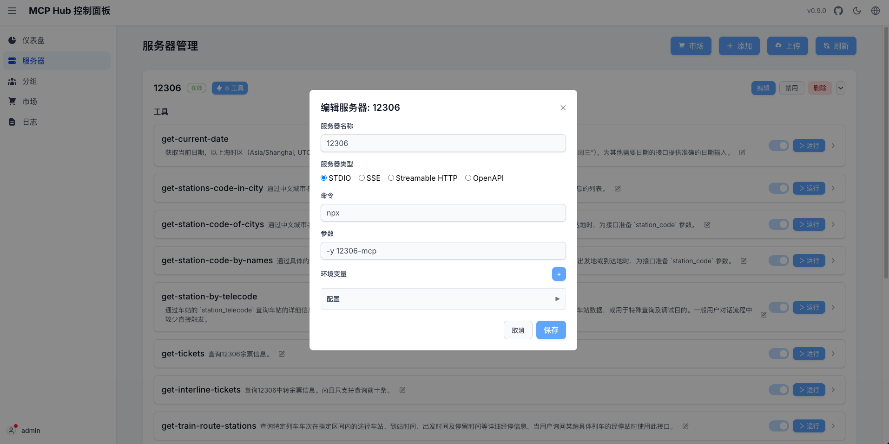
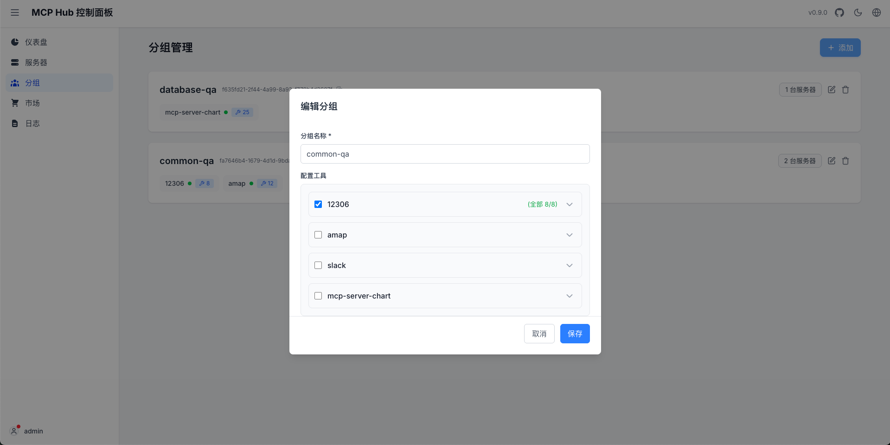
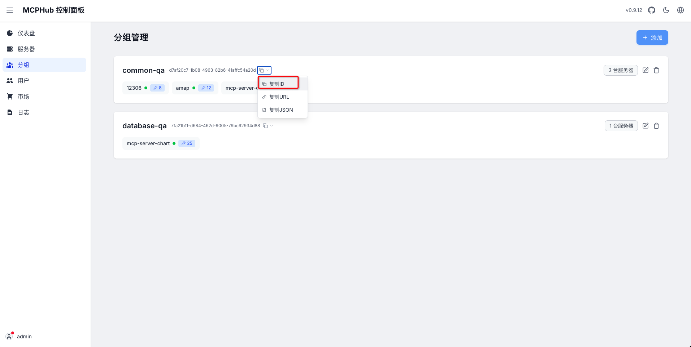

## 💡环境配置要求

在开始之前，请确保您的开发环境满足以下最低配置要求：

- **操作系统**：Windows 10/11, macOs M系列, Centos/Ubuntu
- **GPU**: 本地使用ollama部署，推荐使用Nvidia显卡或CPU模式。**推荐公网购买APIKEY形式**
- **内存**：8GB+

### 🔧 **前置条件**
* Python 3.11.x
* uv 0.8.0+
* Dify 0.7.1+
* Mysql 8.0+
* Node.js 18.12.x+
* Pnpm 9.x
* Mcp-Hub 0.9.0+
* Gpt-vis-api 0.0.1+

### 📚 **大模型选择**
- 推荐购买公网大模型[阿里云公网大模型服务APIKEY](http://aliyun.com/product/bailian)
- 模型要求: **默认使用openai/sdk基本支持所有模型**
- 模型支持: **本地模式**(ollama, vllm...) **公网模式**(deepseek, qwen3...)


### **1. Clone仓库**
```angular2html
git clone https://github.com/apconw/sanic-web.git
```
### **2. 复制配置文件**
> 进入docker目录，复制.env.template文件为.env
```bash
cd docker 
cp .env.template .env 
```

### **3. 执行部署脚本**
> 执行部署脚本报错请查看当前目录下**deploy.log**报错信息
```angular2html
cd docker
# mac或linux环境
./deploy.sh

# Windows环境
./deploy.bat
```

### **4. 中间件配置**
#### 🌲 Mino
> 下面chat-service/gpt-vis-api服务都依赖Minio服务

##### 配置
 - 访问MinIO服务，http://localhost:19001/ 账号:admin 密码:12345678
 - 创建两个个bucket，名称**filedata和chart-images** **同时配置Access Key保存好下面会使用**
 - 修改bucket的**chart-images**访问策略为**public**

 
 

#### 🌵 mcp-hub
- [官方文档](https://github.com/samanhappy/mcphub)
> mcp-hub是一个开源的MCP聚合工具方便安装和管理MCP工具



##### 配置
- 登录http://localhost:3300/ admin/admin123
- **国内镜像配置**
    - Python 包仓库地址: https://mirrors.aliyun.com/pypi/simple
    - NPM 仓库地址: https://registry.npmmirror.com


##### 工具
> 需要安装两个工具mcp-server-chart蚂蚁图表工具/12306火车票查询工具

- **mcp-server-chart**
    - **VIS_REQUEST_SERVER**环境变量配置默认为**gpt-vis-api**服务地址本
    - 本地启动不需要修改如果是服务器部署**host.docker.internal**需要修改为实际IP地址
    - 安装完成后创建一个工具组并复制访问地址先保存一下
    - 复制访问**ID**用于后面步骤配置**MCP_HUB_DATABASE_QA_GROUP_URL**变量时从这里取值
```angular2html
npx -y -y @antv/mcp-server-chart

VIS_REQUEST_SERVER: http://host.docker.internal:3100/generate
```
- 安装工具


- 创建组


- 复制访问**ID**



- **12306火车票查询工具**
    - 安装完成后创建一个工具组并复制访问地址先保存一下
    - 复制访问**ID**用于后面步骤配置**MCP_HUB_COMMON_QA_GROUP_URL**变量时从这里取值
```angular2html
npx -y 12306-mcp
```
- 安装工具


- 创建组


- 复制访问**ID**


